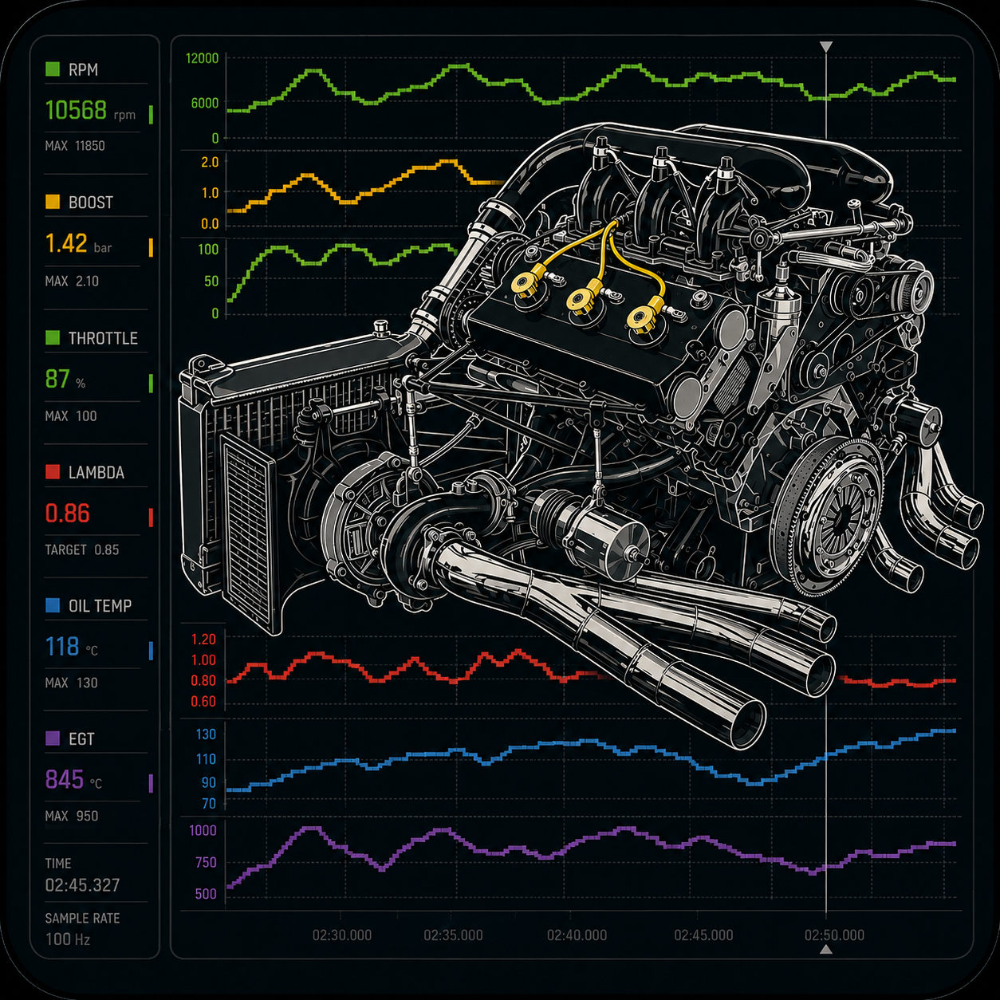
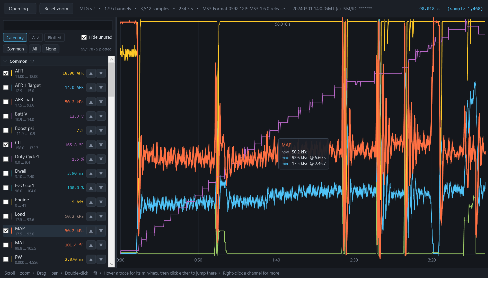

<p align="center">
  
</p>

<h1 align="center">OpenLogViewer</h1>

<p align="center">
  A native Windows datalog viewer for MegaSquirt, TunerStudio and other ECU logs.<br>
  Built on .NET 10 and WPF, with no third-party dependencies.
</p>

<p align="center">
  
</p>

---

Open a `.mlg`, `.msl` or `.csv` log, pick channels, and scrub through them.



## Supported logs

| Source | Format | Status |
|---|---|---|
| MegaSquirt / TunerStudio | `.mlg` binary | **Verified** against MS2 and MS3 logs, incl. markers and flag bytes |
| MegaSquirt / TunerStudio | `.msl` text | **Verified** against 43 real logs, MS3 1.3.3 through 3.3 |
| rusEFI | `.mlg`, `.msl` | Same `MLVLG` container and text layout |
| MaxxECU, Haltech, MoTeC, Link, AEM, ECUMaster, Holley, HP Tuners, Speeduino | CSV / TSV export | Handled by the generic text reader |
| Anything else | delimited text | Handled if it has a header row and numeric columns |

Nothing is assumed from the file extension — content is sniffed instead. The
text reader auto-detects encoding, delimiter, header and units rows, decimal
separator and time base, which is what lets one code path cover exports from
tools that agree on almost nothing:

- **Delimiters** tab, comma, semicolon or pipe, chosen by which one splits the
  file most consistently rather than by which is most frequent
- **Decimal comma** (`1234,5`) as used by European-locale exports
- **Quoted fields** containing the delimiter (RFC 4180)
- **Units** from a dedicated units row *or* bracketed in the header
  (`MAP (kPa)`, `RPM [rpm]`, `CLT {degC}`)
- **Encoding** UTF-8 or Latin-1 — older TunerStudio exports are ISO-8859-1,
  where `°F` is a single byte that is not valid UTF-8
- **Time base** in seconds, milliseconds or minutes, from a wall-clock timestamp
  column, or synthesised from the sample index when there is no usable time
  column. A log that starts at t=2178 s, or at a negative time, is fine
- **Duplicate channel names** disambiguated by units — MS3 emits
  `Fuel Consumption` twice, in GPH and l/hr

If you have a log from an ECU not listed above that does not load, the format is
usually easy to add — the reader is one file, and `--categories` on the dump tool
shows how its channels were understood.

## Histogram / table mode

Switch to **Histogram** in the toolbar to bin the log into a table — the same
shape as the VE or AFR table in the ECU, so a drive can be read against the tune
it came from.

Pick any three channels: two axes and a value. Each cell reduces the samples that
landed in it by mean, min, max or count, over a table up to 40 × 40. *Only the
zoomed time range* restricts it to the window you zoomed to in the log view, so a
table can be built from a single pull rather than the whole drive. Hovering a
cell reports the bin, the value, and how many samples back it.

Cells use a **single-hue sequential ramp**, light for high and dark for low, not
the green/yellow/red seen elsewhere. A rainbow ramp has no inherent order — the
eye cannot rank yellow against cyan — and it collapses under colour-vision
deficiency and in greyscale. Lightness ranks unambiguously for everyone. The ramp
is validated against this app's surface: the low end holds 2.71:1 against it, so a
barely-populated cell still reads as distinct from an empty one, and cell text
flips between light and dark ink to stay legible on every step.

*Colour by sample count* re-shades the same table by how much data backs each
cell, which is the quick way to see which parts of the table the drive actually
exercised.

### Data filters

A table built from a whole drive averages warmup, overrun and idle into the same
cells as the pulls you care about, and describes none of them. Filters throw out
the samples that do not belong.

Each filter is a condition on a channel — `CLT ≥ 160`, `TPS > 1`, `AFR between 9
and 20` — and they combine with AND: a sample must satisfy every ticked
condition to be counted. Opening a log offers suggestions for the channels it
has, always switched off, so loading a log never silently changes what the table
counts. Add your own with **+ Add filter**; right-click one to delete it.

Two things follow from filtering that are easy to miss:

- The status line reports how many samples were excluded, so a suspiciously
  sparse table explains itself rather than looking broken.
- **The axes re-scale to the samples that survive.** Filtering to warm running
  also tightens the RPM and MAP range onto that data, which is usually what you
  want — but it means two differently-filtered tables are not directly
  comparable cell for cell.

Filters are matched to channels by name and persist between sessions in
`%APPDATA%\OpenLogViewer\filters.json`. A filter naming a channel the log does
not have is reported and skipped, never applied as "reject everything".

## Features

- **Binary `.mlg` support**, including packed flag bytes and interleaved marker
  records — see [`docs/mlg-format.md`](docs/mlg-format.md)
- Channel sidebar with search, per-channel range, and a live value readout that
  follows the cursor
- **Channels grouped by system** — Common, Engine, Air & boost, Fuel, Ignition,
  Temperature, Idle, Electrical, Diagnostics — in collapsible sections
- **Hide unused**, on by default: logs routinely declare channels that never
  move (98 of 179 in one sample), and hiding them makes the rest findable
- Sort by category, A–Z, or plotted-first; **Common** plots the usual set in one
  click
- **Named presets** — plot the channels you want, click *+ Save*, name it, and it
  becomes a chip you can click to restore that exact selection. Presets persist
  between sessions and are matched by channel name, so one saved on a log applies
  to any other log that shares those names. Right-click a preset to overwrite or
  delete it. Stored as readable JSON at
  `%APPDATA%\OpenLogViewer\presets.json`, which you can hand-edit or copy between
  machines
- **Hover a trace to interrogate it** — the nearest trace to the pointer is
  thickened, its row highlights in the sidebar, and a readout gives its value at
  the cursor plus its maximum and minimum *and the moment each occurs*
- **Jump to a channel's extremes**, three ways — the ▲ / ▼ buttons on any channel
  row, right-click → *Jump to maximum / minimum*, or click the max or min line in
  the hover readout itself. All keep the current zoom and plot the channel first
  if it was not already showing
- Overlaid traces, each scaled to its own range — how tuners actually read logs,
  where phase relationships matter more than shared magnitude
- Scroll to zoom at the pointer, drag to pan, double-click to fit
- Log markers drawn in place on the timeline
- **Gaps in logging are drawn as gaps.** Paused-and-resumed logs are common, and
  a straight line across an eight-minute pause reads as steady data that was
  never recorded. Traces lift the pen when the step between samples exceeds ten
  times the log's median sample interval
- Min/max envelope decimation, so a 37,000-sample log scrubs smoothly
- No third-party dependencies

## Requirements

- Windows
- [.NET 10 SDK](https://dotnet.microsoft.com/download) to build; the
  Windows Desktop runtime to run

## Build and run

```powershell
dotnet build OpenLogViewer.slnx -c Release
dotnet run --project src/OpenLogViewer.App -c Release
```

You can also pass a log directly, or drop one onto the window:

```powershell
dotnet run --project src/OpenLogViewer.App -c Release -- path\to\log.mlg
```

### Console dump

`OpenLogViewer.Dump` decodes a log and prints a summary. It doubles as the
regression check for the readers:

```powershell
dotnet run --project tools/OpenLogViewer.Dump -c Release -- path\to\log.mlg --channels
```

```
=== 2026-07-26_13.23.25.mlg ===
  format    : MLG v2
  channels  : 179
  samples   : 37,328
  duration  : 2790.98 s  (Time base)
  markers   : 22
    RPM       RPM             0 .. 6960
    MAP       kPa           9.2 .. 176.5
    Batt V    v             8.7 .. 15.2
```

Add `--categories` to see how each channel was grouped, which is the quickest
way to check the classifier against a new firmware:

```
Common (17)
    AFR, AFR 1 Target, AFR load, Batt V
    Boost psi, CLT, Duty Cycle1, Dwell ...
Ignition (24)
    Ign load, Knock in, SPK: Base Spark Advance, SPK: Knock retard ...
```

### Tests

```powershell
dotnet test -c Release
```

The MLG tests build synthetic log files in memory, so they cover the awkward
cases — packed flag bytes, interleaved markers, scale/transform — without
needing sample logs checked into the repository.

The viewer can also render itself to a PNG, which is how the screenshot above is
produced (capturing from another process is unreliable under DWM composition):

```powershell
OpenLogViewer.App.exe path\to\log.mlg --screenshot out.png
```

Add `--pointer 0.42,0.55` (fractions of the plot area) to place the cursor first,
so the hover readout appears in the capture.

## Layout

```
src/OpenLogViewer.App/AppIcon.ico  application icon (see below)
src/OpenLogViewer.Core    format readers and the log model (no UI dependency)
src/OpenLogViewer.App     WPF viewer
tools/OpenLogViewer.Dump  console decoder / regression harness
tests/OpenLogViewer.Tests xunit tests
docs/mlg-format.md        the MLG binary format
```

`OpenLogViewer.Core` targets plain `net10.0` and has no WPF reference, so it can
be reused from a console tool, a test, or a non-Windows host.

## Icon and logo

`AppIcon.ico` carries ten sizes (16 → 256) with **two different pieces of art**:

- **64 px and above** — the full illustration ([`docs/logo.png`](docs/logo.png)),
  which is also the project logo above
- **Below 64 px** — a drawn mark ([`docs/mark.png`](docs/mark.png)): an RPM trace
  climbing through gear shifts, with a boost trace beneath it

The photographic artwork is unreadable at taskbar size — at 16 px a detailed
scene is just a smudge — so the small entries get a purpose-drawn glyph instead.
The mark is rendered natively at each size rather than downscaled, so its strokes
stay crisp, and it sits on a mid-dark slate tile that holds its own against both
light and dark taskbars (the near-black illustration does not).

## On provenance

Original work. This project is not derived from any existing application, and no
proprietary software was decompiled, disassembled, or otherwise reverse
engineered to build it.

The MLG format was reconstructed by reading sample `.mlg` files directly. The
container is self-describing — it carries its own channel names, data types,
units and scaling factors — so the layout was recovered by inspecting file
headers, testing candidate record strides against physical plausibility
(battery voltage sits at 12–14.5 V; coolant temperature reaches 160–200 °F),
and confirming that the resulting record count divides the file exactly. That
process is documented in [`docs/mlg-format.md`](docs/mlg-format.md) so it can be
independently checked.

## License

MIT — see [LICENSE](LICENSE).

This is a tool for engine tuning. It only reads log files and never writes to an
ECU, but tuning decisions made with it are yours; the authors accept no
liability for engine damage.
